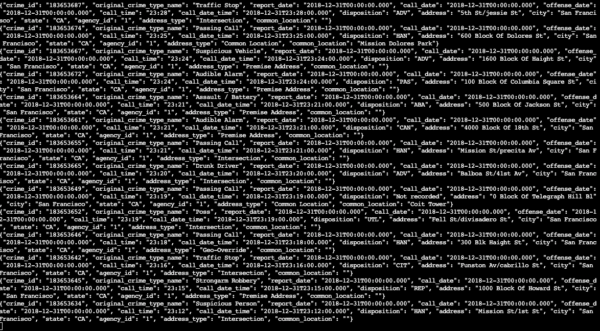
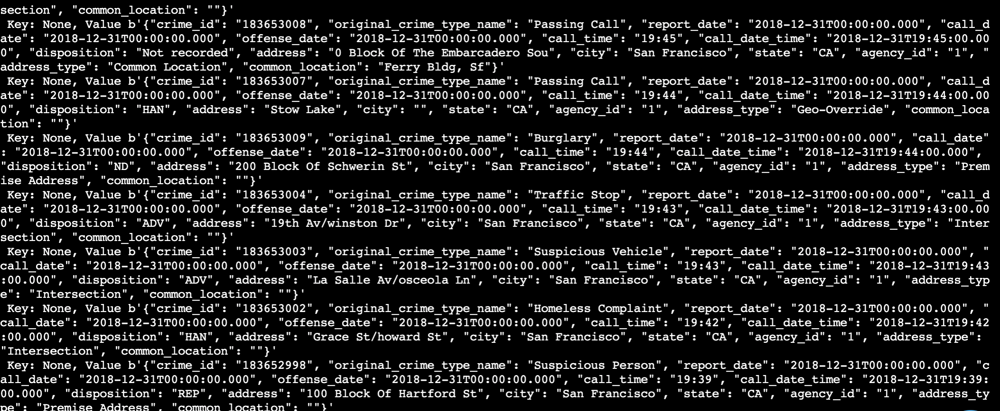
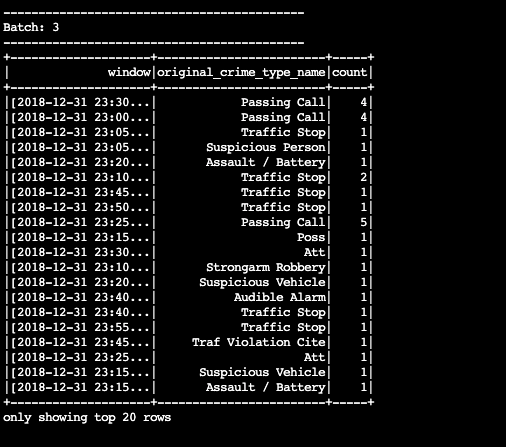
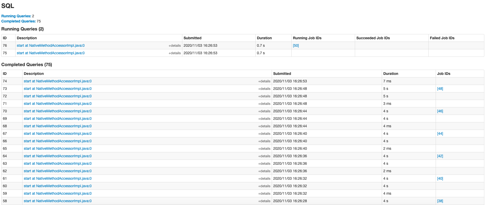

# SF Crime Statistics with Spark Streaming

This project uses Kafka & Spark Structured Streaming in Order to stream process SF Crime Statistic Data.

*How to Use:*

- Run `/usr/bin/zookeeper-server-start config/zookeeper.properties` in order to start the zookeeper server
- Run `/usr/bin/kafka-server-start config/server.properties` in order to start the kafka server
- Install all necessary packages by running `./start.sh`
- Produce messages to the kafka topic with `kafka_server.py`
- In order to assess if the producer is properly sending messages to Kafka, use the CLI to validate: `kafka-console-consumer --bootstrap-server localhost:9092 --topic police.department.service.calls --from-beginning`
- the output should look something like this:

- As another sanity check, running `consumer_server.py` will also print messages to the console, although this is not explicitly necessary as Spark Streaming has a Kafka integration
- Output should look like:

- Lastly, the Spark Streaming application can be run using `spark-submit --packages org.apache.spark:spark-sql-kafka-0-10_2.11:2.3.4 --master local[*] data_stream.py`
- This will print progress to the console, which should look like:

- The Spark UI should also look like:

## Analysis

1) *How did changing values on the SparkSession property parameters affect the throughput and latency of the data?*

The most important parameter in order to affect the throughput of data is `maxOffsetsPerTrigger`. This parameter sets the # of messages retrieved from a Kafka Topic in a single trigger. By increasing this parameter, more messages can be consumed in a single 'batch'. Also, `maxRatePerPartition` can be tuned in order to increase message throughput. A higher amount will mean more messages read from each partition per second

2) *What were the 2-3 most efficient SparkSession property key/value pairs? Through testing multiple variations on values, how can you tell these were the most optimal?*

Some important properties are related to memort like `spark.executor.memory` or `spark.driver.memory`. Since we were working on a small dataset, this wasn't the most noticeable change as I increased the memory, but it would definitely have an impact on larger datasets.

Another property that optimization becomes more needed as datasets increase in size is `spark.default.parallelism`. Once again, tweaking this parameter didn't make much of a difference in this case because of the smaller dataset.

Lastly, as discussed above `maxOffsetsPerTrigger` and `maxRatePerPartition` are important because they directly affect the throughput of the data. I played around and found that 1000 for both produced an optimal throughput. 
